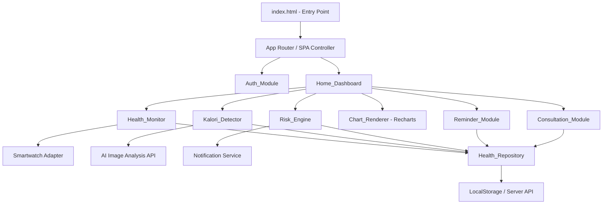
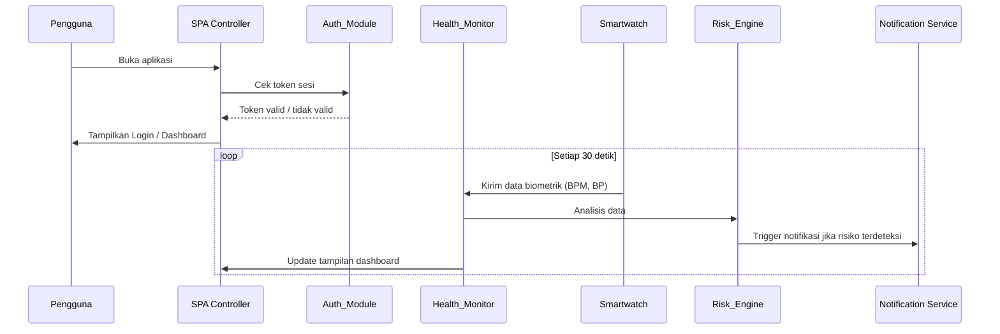

# Dokumen Desain: PANTAS (Platform Monitoring PTM Terintegrasi)

## Overview

PANTAS adalah aplikasi web berbasis JavaScript/HTML/CSS yang terintegrasi dengan smartwatch untuk memantau kesehatan pengguna secara real-time dan mendeteksi dini risiko Penyakit Tidak Menular (PTM). Aplikasi ini dibangun sebagai Single Page Application (SPA) dengan arsitektur berbasis modul, menggunakan Recharts untuk visualisasi data dan AI berbasis gambar untuk deteksi kalori makanan.

Fitur utama meliputi:
- Autentikasi pengguna dengan manajemen sesi berbasis token
- Dashboard terpadu yang menampilkan ringkasan data kesehatan real-time
- Monitoring detak jantung dan tekanan darah dari smartwatch
- Deteksi kalori makanan berbasis AI (analisis gambar)
- Notifikasi risiko PTM dengan klasifikasi tiga tingkat
- Riwayat data kesehatan dengan filter dan enkripsi
- Grafik tren interaktif menggunakan Recharts
- Pengingat minum obat dengan notifikasi push
- Manajemen jadwal konsultasi dokter

---

## Architecture

Aplikasi menggunakan arsitektur modular berbasis vanilla JavaScript dengan pola MVC ringan. Setiap modul bertanggung jawab atas domain fungsionalnya sendiri dan berkomunikasi melalui event bus terpusat.



### Alur Data Utama



### Keputusan Arsitektur

1. **Vanilla JS + Modul ES6**: Sesuai dengan stack yang sudah ada (HTML/CSS/JS), tanpa framework berat. Modul diorganisir per domain fungsional.
2. **Recharts via CDN/bundler**: Digunakan untuk grafik tren karena sudah ditentukan dalam requirements.
3. **LocalStorage sebagai fallback**: Data disimpan sementara di localStorage saat koneksi server terputus, lalu disinkronkan ulang.
4. **Event Bus**: Komunikasi antar modul menggunakan custom events untuk menjaga loose coupling.
5. **AI Kalori via REST API**: Analisis gambar makanan didelegasikan ke API eksternal (misalnya Clarifai Food Model atau Nutritionix) untuk menghindari beban komputasi di sisi klien.

---

## Components and Interfaces

### Auth_Module

Bertanggung jawab atas autentikasi pengguna dan manajemen sesi.

```javascript
// Interface Auth_Module
{
  // Render halaman login
  renderLoginPage(): void,

  // Autentikasi pengguna
  login(email: string, password: string): Promise<{ success: boolean, token?: string, error?: string }>,

  // Logout dan hapus sesi
  logout(): void,

  // Validasi form sebelum submit
  validateLoginForm(email: string, password: string): { valid: boolean, errors: object },

  // Simpan token sesi
  saveSession(token: string): void,

  // Ambil token sesi aktif
  getSession(): string | null,

  // Hapus token sesi
  clearSession(): void,
}
```

### Health_Monitor

Mengelola penerimaan dan pemrosesan data biometrik dari smartwatch.

```javascript
// Interface Health_Monitor
{
  // Mulai polling data dari smartwatch
  startMonitoring(intervalMs: number): void,

  // Hentikan polling
  stopMonitoring(): void,

  // Proses data detak jantung baru
  processHeartRate(bpm: number, timestamp: Date): HeartRateReading,

  // Proses data tekanan darah baru
  processBloodPressure(systolic: number, diastolic: number, timestamp: Date): BloodPressureReading,

  // Ambil status koneksi smartwatch
  getConnectionStatus(): 'connected' | 'disconnected' | 'error',

  // Ambil pembacaan terakhir
  getLastReading(): { heartRate: HeartRateReading | null, bloodPressure: BloodPressureReading | null },
}
```

### Kalori_Detector

Mengelola analisis gambar makanan untuk estimasi kalori.

```javascript
// Interface Kalori_Detector
{
  // Buka kamera dan ambil foto
  openCamera(): Promise<Blob>,

  // Analisis gambar makanan
  analyzeFood(imageBlob: Blob): Promise<FoodAnalysisResult>,

  // Simpan hasil deteksi ke riwayat
  saveDetectionResult(result: FoodAnalysisResult): Promise<void>,
}
```

### Risk_Engine

Menganalisis data kesehatan dan menentukan tingkat risiko PTM.

```javascript
// Interface Risk_Engine
{
  // Analisis data dan tentukan risiko
  analyzeRisk(data: HealthData): RiskAssessment,

  // Klasifikasi tingkat risiko
  classifyRisk(assessment: RiskAssessment): 'low' | 'medium' | 'high',

  // Trigger notifikasi berdasarkan risiko
  triggerNotification(assessment: RiskAssessment): void,

  // Ambil rekomendasi berdasarkan risiko
  getRecommendations(riskLevel: string): string[],
}
```

### Chart_Renderer

Merender grafik tren data kesehatan menggunakan Recharts.

```javascript
// Interface Chart_Renderer
{
  // Render grafik detak jantung
  renderHeartRateChart(containerId: string, data: HeartRateReading[], timeRange: TimeRange): void,

  // Render grafik tekanan darah
  renderBloodPressureChart(containerId: string, data: BloodPressureReading[], timeRange: TimeRange): void,

  // Update grafik dengan rentang waktu baru
  updateTimeRange(chartId: string, timeRange: TimeRange): void,

  // Format data untuk Recharts
  formatChartData(readings: HealthReading[], timeRange: TimeRange): ChartDataPoint[],
}
```

### Health_Repository

Mengelola penyimpanan dan pengambilan data kesehatan.

```javascript
// Interface Health_Repository
{
  // Simpan pembacaan detak jantung
  saveHeartRate(reading: HeartRateReading): Promise<void>,

  // Simpan pembacaan tekanan darah
  saveBloodPressure(reading: BloodPressureReading): Promise<void>,

  // Simpan asupan kalori
  saveCalorieIntake(entry: CalorieEntry): Promise<void>,

  // Simpan notifikasi risiko
  saveRiskNotification(notification: RiskNotification): Promise<void>,

  // Ambil riwayat berdasarkan filter
  getHistory(filter: HistoryFilter): Promise<HealthRecord[]>,

  // Sinkronisasi data offline ke server
  syncOfflineData(): Promise<void>,
}
```

### Reminder_Module

Mengelola pengingat minum obat.

```javascript
// Interface Reminder_Module
{
  // Tambah pengingat baru
  addReminder(reminder: MedicationReminder): Promise<void>,

  // Hapus pengingat
  removeReminder(reminderId: string): Promise<void>,

  // Tandai pengingat sebagai diminum/dilewati
  markReminder(reminderId: string, status: 'taken' | 'skipped'): Promise<void>,

  // Ambil semua pengingat aktif
  getActiveReminders(): MedicationReminder[],

  // Jadwalkan notifikasi push
  scheduleNotification(reminder: MedicationReminder): void,

  // Batalkan notifikasi
  cancelNotification(reminderId: string): void,
}
```

### Consultation_Module

Mengelola jadwal konsultasi dokter.

```javascript
// Interface Consultation_Module
{
  // Buat jadwal konsultasi baru
  createConsultation(consultation: ConsultationSchedule): Promise<void>,

  // Update jadwal konsultasi
  updateConsultation(id: string, updates: Partial<ConsultationSchedule>): Promise<void>,

  // Batalkan jadwal konsultasi
  cancelConsultation(id: string): Promise<void>,

  // Ambil jadwal mendatang
  getUpcomingConsultations(): ConsultationSchedule[],

  // Ambil riwayat konsultasi
  getConsultationHistory(): ConsultationSchedule[],

  // Ekspor ke kalender perangkat
  exportToCalendar(consultation: ConsultationSchedule): void,
}
```

---

## Data Models

### HeartRateReading

```javascript
{
  id: string,           // UUID unik
  userId: string,       // ID pengguna
  bpm: number,          // Nilai detak jantung (beats per minute)
  timestamp: Date,      // Waktu pengambilan data
  source: 'smartwatch' | 'manual',
  isAbnormal: boolean,  // true jika < 50 atau > 100 BPM
}
```

### BloodPressureReading

```javascript
{
  id: string,
  userId: string,
  systolic: number,     // Tekanan sistolik (mmHg)
  diastolic: number,    // Tekanan diastolik (mmHg)
  timestamp: Date,
  source: 'smartwatch' | 'manual',
  riskLevel: 'normal' | 'elevated' | 'hypertension',
}
```

### FoodAnalysisResult

```javascript
{
  id: string,
  userId: string,
  foodName: string,         // Nama makanan terdeteksi
  calories: number,         // Estimasi kalori (kkal)
  carbohydrates: number,    // Karbohidrat (gram)
  protein: number,          // Protein (gram)
  fat: number,              // Lemak (gram)
  imageUrl: string,         // URL gambar yang dianalisis
  timestamp: Date,
  confidence: number,       // Tingkat kepercayaan AI (0-1)
}
```

### RiskAssessment

```javascript
{
  id: string,
  userId: string,
  riskLevel: 'low' | 'medium' | 'high',  // Rendah/Sedang/Tinggi
  riskColor: 'green' | 'yellow' | 'red',
  triggerData: {
    heartRate?: HeartRateReading,
    bloodPressure?: BloodPressureReading,
    calorieIntake?: FoodAnalysisResult,
  },
  description: string,        // Deskripsi kondisi yang terdeteksi
  recommendations: string[],  // Saran tindakan
  timestamp: Date,
  notificationSent: boolean,
}
```

### MedicationReminder

```javascript
{
  id: string,
  userId: string,
  medicationName: string,   // Nama obat
  dosage: string,           // Dosis (misal: "500mg")
  frequency: 'daily' | 'twice_daily' | 'three_times_daily' | 'weekly' | 'custom',
  scheduledTimes: string[], // Array waktu dalam format "HH:MM"
  isActive: boolean,
  createdAt: Date,
  lastStatus?: 'taken' | 'skipped' | 'pending',
}
```

### ConsultationSchedule

```javascript
{
  id: string,
  userId: string,
  doctorName: string,
  specialization: string,
  scheduledDate: Date,
  scheduledTime: string,    // Format "HH:MM"
  method: 'in_person' | 'online',
  status: 'upcoming' | 'completed' | 'cancelled',
  reminderSet: boolean,
  notes?: string,
}
```

### HistoryFilter

```javascript
{
  dataType: 'heart_rate' | 'blood_pressure' | 'calorie' | 'risk_notification' | 'all',
  startDate: Date,
  endDate: Date,
  userId: string,
}
```

### SessionData

```javascript
{
  token: string,        // JWT atau session token
  userId: string,
  email: string,
  expiresAt: Date,
}
```

### ChartDataPoint

```javascript
{
  timestamp: string,    // Format ISO untuk sumbu-X
  value: number,        // Nilai utama (BPM atau mmHg)
  systolic?: number,    // Khusus grafik tekanan darah
  diastolic?: number,   // Khusus grafik tekanan darah
}
```

---

## Correctness Properties

*A property is a characteristic or behavior that should hold true across all valid executions of a system — essentially, a formal statement about what the system should do. Properties serve as the bridge between human-readable specifications and machine-verifiable correctness guarantees.*

**Property Reflection:** Setelah menganalisis semua acceptance criteria, beberapa property dikonsolidasikan untuk menghindari redundansi:
- Property penyimpanan detak jantung (4.5) dan tekanan darah (5.5) digabung dengan property round-trip Health_Repository (7.1) menjadi satu property penyimpanan umum.
- Property update tampilan BPM (4.2) dan tekanan darah (5.2) digabung karena keduanya menguji hal yang sama: tampilan selalu mencerminkan data terbaru.
- Property format grafik detak jantung (8.2) dan tekanan darah (8.3) digabung dengan property Chart_Renderer (4.3, 5.3) karena menguji fungsi `formatChartData` yang sama.
- Property klasifikasi risiko (6.3) mencakup property trigger notifikasi (6.2) karena jika klasifikasi benar, notifikasi pasti dipicu.

---

### Property 1: Validasi form login menolak input kosong/whitespace

*For any* string yang terdiri seluruhnya dari whitespace (atau string kosong) yang dimasukkan sebagai email atau password, fungsi `validateLoginForm` SHALL mengembalikan objek errors yang berisi pesan validasi untuk field yang kosong, dan form tidak boleh dikirimkan ke server.

**Validates: Requirements 1.4**

---

### Property 2: Sesi tersimpan dan dapat diambil kembali (round-trip)

*For any* token sesi yang valid, memanggil `saveSession(token)` kemudian `getSession()` SHALL mengembalikan token yang identik dengan yang disimpan.

**Validates: Requirements 1.5**

---

### Property 3: Logout membersihkan sesi

*For any* sesi aktif yang tersimpan, memanggil `logout()` SHALL mengakibatkan `getSession()` mengembalikan `null`, sehingga tidak ada token sesi yang tersisa.

**Validates: Requirements 1.6**

---

### Property 4: Tampilan dashboard selalu mencerminkan data terbaru

*For any* nilai BPM atau pasangan (systolic, diastolic) yang diterima dari smartwatch, fungsi update dashboard SHALL menghasilkan tampilan yang menampilkan nilai tersebut secara akurat — tidak ada nilai lama yang tertinggal di tampilan.

**Validates: Requirements 2.2, 2.3, 4.2, 5.2**

---

### Property 5: Koneksi terputus selalu menampilkan data terakhir

*For any* pembacaan terakhir yang tersimpan, ketika status koneksi smartwatch berubah menjadi `'disconnected'`, Health_Monitor SHALL selalu menampilkan data terakhir tersebut beserta timestampnya — tidak pernah menampilkan tampilan kosong.

**Validates: Requirements 2.6**

---

### Property 6: Hasil analisis kalori selalu lengkap

*For any* gambar makanan yang berhasil dianalisis oleh Kalori_Detector, hasil `FoodAnalysisResult` SHALL selalu berisi semua field nutrisi (foodName, calories, carbohydrates, protein, fat) dengan nilai non-null dan non-negative.

**Validates: Requirements 3.3**

---

### Property 7: Penyimpanan data kesehatan adalah round-trip

*For any* data kesehatan (HeartRateReading, BloodPressureReading, CalorieEntry, atau RiskNotification) yang disimpan melalui Health_Repository, mengambil kembali data tersebut SHALL menghasilkan objek yang identik dengan yang disimpan, termasuk timestamp.

**Validates: Requirements 3.5, 4.5, 5.5, 6.5, 7.1, 7.3**

---

### Property 8: Pemrosesan data biometrik menghasilkan reading yang valid

*For any* nilai BPM valid (integer positif) atau pasangan (systolic, diastolic) valid, fungsi `processHeartRate` dan `processBloodPressure` SHALL selalu menghasilkan objek reading yang memiliki semua field wajib (id, userId, nilai, timestamp, source) dengan nilai yang sesuai input.

**Validates: Requirements 4.1, 5.1**

---

### Property 9: Deteksi anomali detak jantung selalu akurat

*For any* nilai BPM, jika BPM < 50 atau BPM > 100, maka `Risk_Engine.analyzeRisk` SHALL mengklasifikasikan kondisi sebagai abnormal dan `isAbnormal` pada HeartRateReading SHALL bernilai `true`. Sebaliknya, jika 50 ≤ BPM ≤ 100, kondisi SHALL diklasifikasikan sebagai normal.

**Validates: Requirements 4.4**

---

### Property 10: Deteksi hipertensi selalu akurat

*For any* pasangan (systolic, diastolic), jika systolic > 140 atau diastolic > 90, maka `Risk_Engine` SHALL mengklasifikasikan kondisi sebagai `'hypertension'` dan `riskLevel` pada BloodPressureReading SHALL bernilai `'hypertension'`. Sebaliknya, jika systolic ≤ 140 dan diastolic ≤ 90, kondisi SHALL diklasifikasikan sebagai normal atau elevated sesuai threshold.

**Validates: Requirements 5.4**

---

### Property 11: Klasifikasi risiko PTM selalu menghasilkan kategori valid

*For any* kombinasi data kesehatan (HealthData), fungsi `classifyRisk` SHALL selalu mengembalikan tepat salah satu dari tiga nilai: `'low'`, `'medium'`, atau `'high'`, dengan warna yang sesuai (`'green'`, `'yellow'`, `'red'`). Tidak ada nilai lain yang diperbolehkan.

**Validates: Requirements 6.1, 6.3**

---

### Property 12: Risiko tinggi selalu menyertakan saran konsultasi dokter

*For any* RiskAssessment dengan `riskLevel === 'high'`, fungsi `getRecommendations` SHALL selalu mengembalikan array yang mengandung setidaknya satu rekomendasi yang menyebutkan konsultasi dokter.

**Validates: Requirements 6.6**

---

### Property 13: Filter riwayat kesehatan selalu konsisten

*For any* kumpulan HealthRecord dan HistoryFilter yang valid, fungsi `getHistory` SHALL mengembalikan hanya record yang memenuhi semua kriteria filter (dataType dan rentang tanggal) — tidak ada record di luar filter yang dikembalikan, dan tidak ada record yang memenuhi filter yang dihilangkan.

**Validates: Requirements 7.2**

---

### Property 14: Format data grafik selalu valid untuk Recharts

*For any* array HeartRateReading atau BloodPressureReading, fungsi `formatChartData` SHALL menghasilkan array ChartDataPoint di mana setiap titik memiliki field `timestamp` (string ISO) dan `value` (number) untuk detak jantung, atau `systolic` dan `diastolic` (number) untuk tekanan darah — tidak ada titik dengan nilai null atau undefined.

**Validates: Requirements 4.3, 5.3, 8.2, 8.3**

---

### Property 15: Konfigurasi grafik selalu menyertakan garis referensi batas normal

*For any* konfigurasi grafik yang dihasilkan oleh Chart_Renderer, konfigurasi tersebut SHALL selalu menyertakan reference lines untuk batas normal: detak jantung (50 BPM dan 100 BPM), tekanan darah sistolik (90 mmHg dan 140 mmHg), dan diastolik (60 mmHg dan 90 mmHg).

**Validates: Requirements 8.5**

---

### Property 16: Tooltip grafik selalu berisi nilai dan timestamp

*For any* ChartDataPoint, fungsi tooltip formatter SHALL menghasilkan string yang mengandung nilai numerik data dan representasi timestamp yang dapat dibaca manusia.

**Validates: Requirements 8.6**

---

### Property 17: Pengingat obat tersimpan dan dapat diambil kembali (round-trip)

*For any* MedicationReminder yang valid, menambahkan pengingat melalui `addReminder` kemudian memanggil `getActiveReminders` SHALL menghasilkan daftar yang mengandung pengingat tersebut dengan semua field yang identik.

**Validates: Requirements 9.1**

---

### Property 18: Hanya pengingat aktif yang dikembalikan

*For any* campuran pengingat aktif (`isActive: true`) dan tidak aktif (`isActive: false`), fungsi `getActiveReminders` SHALL hanya mengembalikan pengingat dengan `isActive === true` — tidak ada pengingat tidak aktif yang bocor ke daftar.

**Validates: Requirements 9.4**

---

### Property 19: Penghapusan pengingat menghilangkannya dari daftar aktif

*For any* pengingat aktif yang ada, memanggil `removeReminder(id)` SHALL mengakibatkan pengingat tersebut tidak lagi muncul di hasil `getActiveReminders`.

**Validates: Requirements 9.5**

---

### Property 20: Jadwal konsultasi tersimpan dan dapat diambil kembali (round-trip)

*For any* ConsultationSchedule yang valid, membuat jadwal melalui `createConsultation` kemudian memanggil `getUpcomingConsultations` SHALL menghasilkan daftar yang mengandung jadwal tersebut dengan semua field yang identik.

**Validates: Requirements 10.1**

---

### Property 21: Pengingat konsultasi selalu dijadwalkan 1 jam sebelumnya

*For any* ConsultationSchedule dengan tanggal dan waktu yang valid, setelah `createConsultation` dipanggil, pengingat otomatis SHALL dijadwalkan pada waktu yang tepat 60 menit sebelum `scheduledDate + scheduledTime`.

**Validates: Requirements 10.2**

---

### Property 22: Hanya jadwal upcoming yang dikembalikan oleh getUpcomingConsultations

*For any* campuran jadwal dengan status `'upcoming'`, `'completed'`, dan `'cancelled'`, fungsi `getUpcomingConsultations` SHALL hanya mengembalikan jadwal dengan `status === 'upcoming'`.

**Validates: Requirements 10.3**

---

### Property 23: Pembatalan jadwal menghilangkannya dari daftar upcoming

*For any* jadwal dengan status `'upcoming'`, memanggil `cancelConsultation(id)` SHALL mengakibatkan jadwal tersebut tidak lagi muncul di hasil `getUpcomingConsultations`.

**Validates: Requirements 10.5**

---

## Error Handling

### Strategi Penanganan Error

| Skenario | Komponen | Penanganan |
|---|---|---|
| Kredensial login tidak valid | Auth_Module | Tampilkan pesan error deskriptif tanpa detail sistem |
| Kolom form kosong | Auth_Module | Validasi client-side sebelum request ke server |
| Koneksi smartwatch terputus | Health_Monitor | Tampilkan indikator peringatan + data terakhir + timestamp |
| AI gagal identifikasi makanan | Kalori_Detector | Tampilkan pesan panduan foto ulang |
| Kegagalan jaringan saat simpan data | Health_Repository | Simpan ke localStorage, sinkronisasi saat online |
| Token sesi kadaluarsa | Auth_Module | Redirect ke halaman login, hapus sesi |
| Nilai biometrik di luar rentang | Risk_Engine | Trigger notifikasi risiko sesuai klasifikasi |
| Grafik gagal render | Chart_Renderer | Tampilkan pesan error dengan opsi refresh |
| Notifikasi push gagal terkirim | Reminder_Module / Risk_Engine | Log error, coba ulang sekali, tampilkan in-app notification |

### Prinsip Error Handling

1. **Fail gracefully**: Setiap komponen harus menangani error tanpa crash seluruh aplikasi.
2. **User-friendly messages**: Pesan error dalam Bahasa Indonesia yang mudah dipahami, tanpa mengekspos detail teknis.
3. **Offline-first**: Data tidak boleh hilang karena kegagalan jaringan — selalu simpan ke localStorage sebagai fallback.
4. **Security**: Pesan error autentikasi tidak boleh mengungkapkan apakah email terdaftar atau tidak.
5. **Logging**: Semua error dicatat di console (development) atau error tracking service (production).

---

## Testing Strategy

### Pendekatan Pengujian Ganda

Pengujian menggunakan dua pendekatan komplementer:
- **Unit tests**: Memverifikasi contoh spesifik, edge case, dan kondisi error
- **Property-based tests**: Memverifikasi properti universal di seluruh input yang dihasilkan secara acak

Library yang digunakan:
- **Vitest**: Test runner (sudah ada di project)
- **fast-check**: Property-based testing library (sudah ada di `devDependencies`)
- **jsdom**: DOM simulation untuk pengujian UI (sudah ada di `devDependencies`)

### Konfigurasi Property-Based Tests

Setiap property test dikonfigurasi dengan minimum **100 iterasi** menggunakan `fc.assert` dari fast-check. Setiap test diberi tag komentar yang mereferensikan property di dokumen desain ini:

```javascript
// Feature: pantas-ptm-monitoring, Property 1: Validasi form login menolak input kosong/whitespace
it('menolak input kosong/whitespace', () => {
  fc.assert(
    fc.property(
      fc.string().filter(s => s.trim() === ''), // whitespace-only strings
      fc.string().filter(s => s.trim() === ''),
      (email, password) => {
        const result = validateLoginForm(email, password);
        return Object.keys(result.errors).length > 0;
      }
    ),
    { numRuns: 100 }
  );
});
```

### Struktur File Test

```
tests/
├── unit/
│   ├── auth.test.js           # Unit tests Auth_Module
│   ├── health-monitor.test.js # Unit tests Health_Monitor
│   ├── kalori-detector.test.js
│   ├── risk-engine.test.js
│   ├── chart-renderer.test.js
│   ├── health-repository.test.js
│   ├── reminder-module.test.js
│   └── consultation-module.test.js
└── property/
    ├── auth.property.test.js           # Properties 1-3
    ├── health-monitor.property.test.js # Properties 4-5, 8-10
    ├── kalori-detector.property.test.js # Properties 6-7
    ├── risk-engine.property.test.js    # Properties 11-12
    ├── chart-renderer.property.test.js # Properties 14-16
    ├── health-repository.property.test.js # Properties 7, 13
    ├── reminder-module.property.test.js # Properties 17-19
    └── consultation-module.property.test.js # Properties 20-23
```

### Cakupan Pengujian per Komponen

| Komponen | Unit Tests | Property Tests | Properties |
|---|---|---|---|
| Auth_Module | Login valid/invalid, logout | 1, 2, 3 | 1, 2, 3 |
| Health_Monitor | Polling, koneksi | 4, 5, 8, 9, 10 | 4, 5, 8, 9, 10 |
| Kalori_Detector | Analisis sukses/gagal | 6, 7 | 6, 7 |
| Risk_Engine | Klasifikasi risiko | 11, 12 | 11, 12 |
| Chart_Renderer | Render grafik, tooltip | 14, 15, 16 | 14, 15, 16 |
| Health_Repository | CRUD, filter, offline sync | 7, 13 | 7, 13 |
| Reminder_Module | CRUD pengingat, notifikasi | 17, 18, 19 | 17, 18, 19 |
| Consultation_Module | CRUD jadwal, pengingat | 20, 21, 22, 23 | 20, 21, 22, 23 |

### Unit Tests (Contoh Spesifik)

Unit tests fokus pada:
- Rendering halaman login dengan elemen yang benar (Req 1.1)
- Dashboard menampilkan data pengguna setelah login (Req 2.1)
- Status koneksi smartwatch ditampilkan dengan benar (Req 2.5)
- Tombol kamera tersedia di dashboard (Req 3.1)
- Detail risiko PTM ditampilkan saat notifikasi dibuka (Req 6.4)
- Data dienkripsi saat disimpan (Req 7.5)
- Recharts digunakan sebagai library grafik (Req 8.1)
- Ekspor jadwal ke kalender perangkat (Req 10.6)

### Integration Tests

Integration tests untuk skenario yang melibatkan timer atau infrastruktur:
- Polling Health_Monitor setiap 30 detik (Req 2.4)
- Update grafik dalam waktu < 2 detik saat rentang waktu berubah (Req 8.4)
- Notifikasi ulang pengingat obat setelah 30 menit (Req 9.6)
