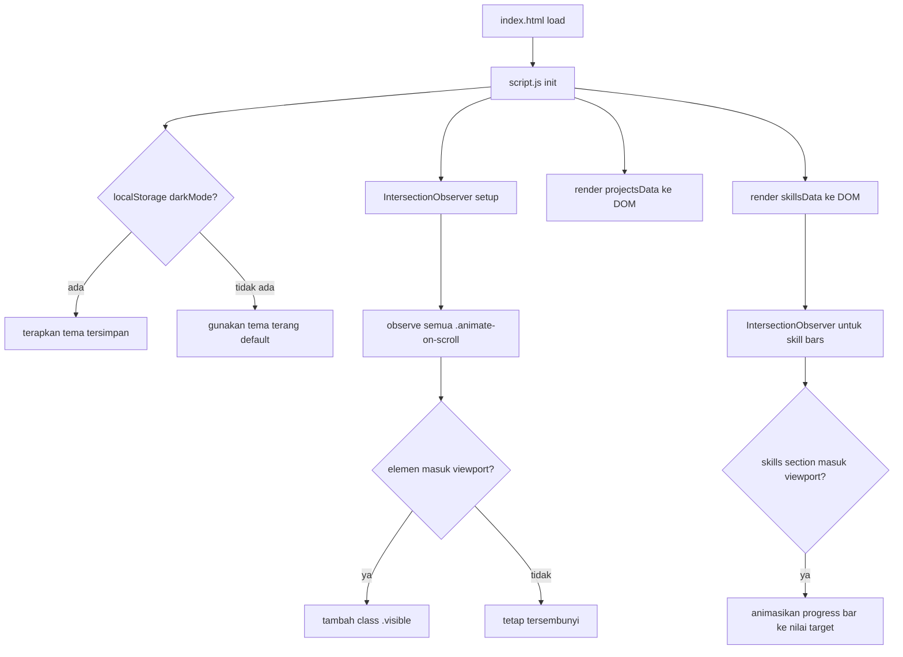

# Design Document: Student Portfolio Website

## Overview

Website portofolio statis satu halaman (single-page) untuk mahasiswa Informatika, dibangun dengan HTML, CSS, dan JavaScript murni tanpa framework. Halaman terdiri dari tujuh seksi utama: Navbar, Hero, About, Skills, Projects, Education, dan Contact. Fitur utama meliputi dark mode dengan persistensi localStorage, animasi scroll berbasis IntersectionObserver, progress bar skill yang dianimasikan, dan validasi form kontak sisi klien.

Karena ini adalah website statis tanpa build tool, seluruh kode ditulis dalam tiga file: `index.html`, `style.css`, dan `script.js`.

---

## Architecture

```
student-portfolio-website/
├── index.html       # Markup semua seksi, referensi ke CSS dan JS
├── style.css        # CSS variables, layout, komponen, animasi, media queries
└── script.js        # Dark mode, scroll animation, skill bar, form validation
```

Tidak ada dependensi eksternal selain font dari Google Fonts dan ikon dari Font Awesome (CDN). Tidak ada server-side logic; semua interaktivitas ditangani di sisi klien.

### Alur Data



---

## Components and Interfaces

### 1. Navbar

```html
<nav id="navbar">
  <div class="nav-brand">Nama Mahasiswa</div>
  <ul class="nav-links">
    <li><a href="#hero">Home</a></li>
    <li><a href="#about">About</a></li>
    <li><a href="#skills">Skills</a></li>
    <li><a href="#projects">Projects</a></li>
    <li><a href="#education">Education</a></li>
    <li><a href="#contact">Contact</a></li>
  </ul>
  <button id="dark-mode-toggle" aria-label="Toggle dark mode">🌙</button>
  <button id="hamburger" aria-label="Toggle menu" aria-expanded="false">☰</button>
</nav>
```

Perilaku:
- `position: fixed; top: 0` agar selalu terlihat
- Active state diperbarui via `IntersectionObserver` pada setiap seksi
- Hamburger toggle menambah/hapus class `.nav-open` pada `<nav>`
- Dark mode toggle memanggil `toggleDarkMode()`

### 2. Hero Section

```html
<section id="hero">
  
  <h1 class="hero-name">Nama Lengkap</h1>
  <p class="hero-tagline">Mahasiswa Informatika | Web Developer</p>
  <div class="hero-buttons">
    <a href="#projects" class="btn btn-primary">Lihat Proyek</a>
    <a href="#contact" class="btn btn-secondary">Kontak Saya</a>
  </div>
</section>
```

### 3. About Section

```html
<section id="about" class="animate-on-scroll">
  <div class="about-text">
    <h2>About Me</h2>
    <p><!-- latar belakang pendidikan --></p>
    <ul class="about-skills-list"><!-- keahlian utama --></ul>
    <p class="about-interests"><!-- minat IT --></p>
  </div>
</section>
```

### 4. Skills Section

Dirender secara dinamis dari `skillsData` array di `script.js`:

```html
<section id="skills">
  <h2>Skills</h2>
  <div class="skills-grid" id="skills-container">
    <!-- Skill cards diinjeksi oleh JS -->
  </div>
</section>
```

Setiap Skill Card:
```html
<div class="skill-card animate-on-scroll">
  <span class="skill-name">HTML</span>
  <div class="progress-bar-track">
    <div class="progress-bar-fill" data-target="90" style="width: 0%"></div>
  </div>
  <span class="skill-level">90%</span>
</div>
```

### 5. Projects Section

Dirender secara dinamis dari `projectsData` array:

```html
<section id="projects">
  <h2>Projects</h2>
  <div class="projects-grid" id="projects-container">
    <!-- Project cards diinjeksi oleh JS -->
  </div>
</section>
```

Setiap Project Card:
```html
<div class="project-card animate-on-scroll">
  
  <div class="project-info">
    <h3 class="project-name">Nama Proyek</h3>
    <p class="project-desc">Deskripsi singkat</p>
    <div class="project-tech">
      <span class="tech-tag">HTML</span>
      <span class="tech-tag">CSS</span>
    </div>
    <div class="project-links">
      <a href="..." class="btn btn-sm" target="_blank">Demo</a>
      <a href="..." class="btn btn-sm btn-outline" target="_blank">GitHub</a>
    </div>
  </div>
</div>
```

### 6. Education Section

```html
<section id="education">
  <h2>Education</h2>
  <div class="timeline">
    <div class="timeline-item animate-on-scroll">
      <div class="timeline-dot"></div>
      <div class="timeline-content">
        <h3>Nama Institusi</h3>
        <p class="edu-program">Teknik Informatika</p>
        <span class="edu-period">2022 – Sekarang</span>
      </div>
    </div>
  </div>
</section>
```

### 7. Contact Section

```html
<section id="contact">
  <h2>Contact</h2>
  <form id="contact-form" novalidate>
    <div class="form-group">
      <label for="name">Nama</label>
      <input type="text" id="name" name="name" required />
      <span class="error-msg" id="name-error"></span>
    </div>
    <div class="form-group">
      <label for="email">Email</label>
      <input type="email" id="email" name="email" required />
      <span class="error-msg" id="email-error"></span>
    </div>
    <div class="form-group">
      <label for="message">Pesan</label>
      <textarea id="message" name="message" required></textarea>
      <span class="error-msg" id="message-error"></span>
    </div>
    <button type="submit" class="btn btn-primary">Kirim Pesan</button>
    <div id="form-success" class="success-msg hidden">Pesan berhasil terkirim!</div>
  </form>
  <div class="contact-info">
    <p>Email: <a href="mailto:email@example.com">email@example.com</a></p>
    <div class="social-links">
      <a href="..." target="_blank" aria-label="GitHub">GitHub</a>
      <a href="..." target="_blank" aria-label="LinkedIn">LinkedIn</a>
    </div>
  </div>
</section>
```

---

## Data Models

### skillsData (JavaScript Array)

```js
const skillsData = [
  { name: "HTML",        level: 90, icon: "fab fa-html5"    },
  { name: "CSS",         level: 85, icon: "fab fa-css3-alt" },
  { name: "JavaScript",  level: 75, icon: "fab fa-js"       },
  { name: "Networking",  level: 70, icon: "fas fa-network-wired" },
  { name: "Linux",       level: 65, icon: "fab fa-linux"    },
  { name: "Database",    level: 60, icon: "fas fa-database" },
];
```

Constraint: `level` harus integer antara 0–100 inklusif.

### projectsData (JavaScript Array)

```js
const projectsData = [
  {
    name:        "Nama Proyek",
    description: "Deskripsi singkat proyek.",
    technologies: ["HTML", "CSS", "JavaScript"],
    image:       "assets/project1.jpg",
    demoUrl:     "https://...",
    githubUrl:   "https://github.com/...",
  },
  // ...
];
```

Constraint: `technologies` harus array non-kosong; `demoUrl` dan `githubUrl` harus string URL valid.

### Dark Mode State

```js
// Disimpan di localStorage
localStorage.setItem("darkMode", "enabled" | "disabled");
```

### Form Validation State (in-memory)

```js
// Objek sementara saat submit
const formState = {
  name:    string,   // tidak boleh kosong atau hanya whitespace
  email:   string,   // harus cocok dengan regex email
  message: string,   // tidak boleh kosong atau hanya whitespace
};
```

### CSS Variables (Design Tokens)

```css
:root {
  /* Light mode */
  --color-primary:    #2563eb;
  --color-secondary:  #64748b;
  --color-bg:         #ffffff;
  --color-bg-alt:     #f1f5f9;
  --color-text:       #1e293b;
  --color-text-muted: #64748b;
  --color-border:     #e2e8f0;
  --color-card-bg:    #ffffff;
  --transition-speed: 250ms;
  --font-size-base:   16px;
  --font-size-min:    14px;
}

[data-theme="dark"] {
  --color-primary:    #3b82f6;
  --color-bg:         #0f172a;
  --color-bg-alt:     #1e293b;
  --color-text:       #f1f5f9;
  --color-text-muted: #94a3b8;
  --color-border:     #334155;
  --color-card-bg:    #1e293b;
}
```

Tema diterapkan dengan menambah/hapus atribut `data-theme="dark"` pada `<html>`.

### Scroll Animation

```js
// IntersectionObserver config
const observerOptions = {
  threshold: 0.15,   // elemen 15% terlihat baru trigger
  rootMargin: "0px",
};

// Setiap elemen .animate-on-scroll dimulai dengan:
// opacity: 0; transform: translateY(30px);
// Saat .visible ditambahkan:
// opacity: 1; transform: translateY(0); transition: 0.6s ease;
```

### Skill Bar Animation

```js
// Dipanggil saat skills section masuk viewport
function animateSkillBars() {
  document.querySelectorAll(".progress-bar-fill").forEach(bar => {
    const target = parseInt(bar.dataset.target, 10);
    bar.style.width = target + "%";
    // CSS transition: width 1s ease-in-out
  });
}
```

### Form Validation Logic

```js
function validateForm(name, email, message) {
  const errors = {};
  if (!name || name.trim() === "")
    errors.name = "Nama tidak boleh kosong.";
  if (!email || email.trim() === "")
    errors.email = "Email tidak boleh kosong.";
  else if (!isValidEmail(email))
    errors.email = "Format email tidak valid.";
  if (!message || message.trim() === "")
    errors.message = "Pesan tidak boleh kosong.";
  return errors; // {} berarti valid
}

function isValidEmail(email) {
  return /^[^\s@]+@[^\s@]+\.[^\s@]+$/.test(email);
}
```

### Active Nav Link Logic

```js
// IntersectionObserver pada setiap <section>
// Saat section masuk viewport, nav link yang sesuai mendapat class .active
const sectionObserver = new IntersectionObserver(entries => {
  entries.forEach(entry => {
    if (entry.isIntersecting) {
      setActiveNavLink(entry.target.id);
    }
  });
}, { threshold: 0.4 });
```

---

## Correctness Properties

*A property is a characteristic or behavior that should hold true across all valid executions of a system — essentially, a formal statement about what the system should do. Properties serve as the bridge between human-readable specifications and machine-verifiable correctness guarantees.*

### Property 1: Scroll Animation Visibility

*For any* elemen HTML yang memiliki class `.animate-on-scroll`, ketika IntersectionObserver callback dipanggil dengan `isIntersecting: true` untuk elemen tersebut, maka elemen tersebut SHALL mendapatkan class `.visible` ditambahkan ke classList-nya.

**Validates: Requirements 3.4, 5.5, 6.3**

---

### Property 2: Active Nav Link Exclusivity

*For any* seksi yang sedang aktif di viewport, nav link yang sesuai SHALL memiliki class `.active`, dan semua nav link lainnya SHALL tidak memiliki class `.active` secara bersamaan.

**Validates: Requirements 1.4**

---

### Property 3: Skill Card Rendering Completeness

*For any* skill object di `skillsData` array dengan properti `name` dan `level` yang valid (level antara 0–100), fungsi render SHALL menghasilkan sebuah card di DOM yang mengandung teks nama skill tersebut dan sebuah progress bar dengan `data-target` yang sama dengan nilai `level`.

**Validates: Requirements 4.1, 4.2**

---

### Property 4: Skill Bar Animation Target

*For any* progress bar element dengan atribut `data-target` bernilai integer N (0 ≤ N ≤ 100), setelah `animateSkillBars()` dipanggil, `style.width` dari elemen tersebut SHALL sama dengan `N + "%"`.

**Validates: Requirements 4.3**

---

### Property 5: Project Card Rendering Completeness

*For any* project object di `projectsData` array dengan properti `name`, `description`, `technologies`, `image`, `demoUrl`, dan `githubUrl` yang valid, fungsi render SHALL menghasilkan sebuah card di DOM yang mengandung: nama proyek, deskripsi, semua tech tag, gambar dengan src yang benar, link demo dengan href yang benar, dan link GitHub dengan href yang benar.

**Validates: Requirements 5.1, 5.2, 5.3**

---

### Property 6: Form Validation — Empty Fields Rejected

*For any* kombinasi input form di mana satu atau lebih field (nama, email, pesan) adalah string kosong atau hanya whitespace, fungsi `validateForm()` SHALL mengembalikan objek errors yang mengandung key untuk setiap field yang tidak valid, dan form SHALL tidak menampilkan notifikasi sukses.

**Validates: Requirements 7.3**

---

### Property 7: Form Validation — Invalid Email Rejected

*For any* string yang tidak cocok dengan pola format email valid (`local@domain.tld`), fungsi `isValidEmail()` SHALL mengembalikan `false`, dan `validateForm()` SHALL menyertakan error untuk field email.

**Validates: Requirements 7.4**

---

### Property 8: Form Validation — Valid Input Accepted

*For any* kombinasi input form di mana nama adalah string non-whitespace, email adalah string format valid, dan pesan adalah string non-whitespace, fungsi `validateForm()` SHALL mengembalikan objek errors kosong `{}`, dan form SHALL menampilkan notifikasi sukses.

**Validates: Requirements 7.2**

---

### Property 9: Dark Mode Toggle Round-Trip

*For any* initial theme state (terang atau gelap), memanggil `toggleDarkMode()` dua kali berturut-turut SHALL mengembalikan `document.documentElement.dataset.theme` ke nilai yang sama dengan state awal sebelum toggle pertama.

**Validates: Requirements 8.2, 8.3**

---

### Property 10: Dark Mode localStorage Persistence

*For any* nilai preferensi dark mode yang disimpan di localStorage (`"enabled"` atau `"disabled"`), ketika `initDarkMode()` dipanggil (mensimulasikan page load), tema yang diterapkan pada `document.documentElement` SHALL sesuai dengan nilai yang tersimpan: `"enabled"` → `data-theme="dark"`, `"disabled"` → tidak ada `data-theme`.

**Validates: Requirements 8.4**

---

## Error Handling

### Form Validation Errors

- Setiap field yang tidak valid menampilkan pesan error inline di bawah field melalui elemen `.error-msg`
- Pesan error dihapus saat pengguna mulai mengetik di field yang bersangkutan (event `input`)
- Jika semua field valid, form menampilkan `#form-success` dan mereset semua field

### Dark Mode Init Error

- Jika `localStorage` tidak tersedia (private browsing di beberapa browser), `initDarkMode()` menggunakan `try/catch` dan fallback ke tema terang default tanpa melempar error

### Image Load Error

- Setiap `` memiliki atribut `alt` yang deskriptif sebagai fallback aksesibilitas
- Project card image menggunakan `onerror` untuk menampilkan placeholder jika gambar gagal dimuat

### IntersectionObserver Fallback

- Jika browser tidak mendukung `IntersectionObserver`, semua elemen `.animate-on-scroll` langsung mendapat class `.visible` sehingga konten tetap terlihat

```js
if (!('IntersectionObserver' in window)) {
  document.querySelectorAll('.animate-on-scroll').forEach(el => {
    el.classList.add('visible');
  });
}
```

---

## Testing Strategy

### Pendekatan Dual Testing

Fitur ini menggunakan dua lapisan pengujian yang saling melengkapi:

1. **Unit tests (example-based)** — untuk pemeriksaan DOM spesifik, keberadaan elemen, dan perilaku konkret
2. **Property-based tests** — untuk memverifikasi properti universal yang berlaku di seluruh input space

### Library Property-Based Testing

Gunakan **fast-check** (JavaScript) untuk property-based testing:

```bash
npm install --save-dev fast-check vitest
```

Setiap property test dikonfigurasi dengan minimum **100 iterasi** (default fast-check).

### Property Tests

Setiap property test harus diberi tag komentar dengan format:
`// Feature: student-portfolio-website, Property N: <deskripsi singkat>`

| Property | Test | Library |
|----------|------|---------|
| P1: Scroll Animation Visibility | Generate elemen dengan class .animate-on-scroll, simulasikan intersection callback, verifikasi class .visible ditambahkan | fast-check |
| P2: Active Nav Link Exclusivity | Generate section ID acak dari daftar valid, panggil setActiveNavLink(), verifikasi hanya satu link yang active | fast-check |
| P3: Skill Card Rendering Completeness | Generate skill objects dengan name acak dan level 0–100, render, verifikasi card mengandung nama dan data-target yang benar | fast-check |
| P4: Skill Bar Animation Target | Generate integer 0–100 sebagai data-target, panggil animateSkillBars(), verifikasi style.width = target% | fast-check |
| P5: Project Card Rendering Completeness | Generate project objects dengan field acak valid, render, verifikasi semua field ada di card | fast-check |
| P6: Form Validation — Empty Fields | Generate kombinasi field kosong/whitespace, panggil validateForm(), verifikasi errors mengandung key yang sesuai | fast-check |
| P7: Form Validation — Invalid Email | Generate string non-email (tanpa @, tanpa domain, dll.), verifikasi isValidEmail() = false | fast-check |
| P8: Form Validation — Valid Input | Generate (nama non-whitespace, email valid, pesan non-whitespace), verifikasi validateForm() = {} | fast-check |
| P9: Dark Mode Toggle Round-Trip | Untuk setiap initial state, toggle dua kali, verifikasi kembali ke state awal | fast-check |
| P10: Dark Mode localStorage Persistence | Untuk setiap nilai "enabled"/"disabled", set localStorage, panggil initDarkMode(), verifikasi tema yang diterapkan | fast-check |

### Unit Tests (Example-Based)

- Navbar mengandung 6 tautan navigasi dengan href yang benar
- Hamburger button muncul pada viewport < 768px
- Hero section mengandung nama, foto, tagline, dan dua tombol CTA
- About section mengandung teks latar belakang, daftar skill, dan minat
- Education entries diurutkan dari tahun terbaru
- Contact form mengandung input name, email, textarea message
- Contact section mengandung mailto link dan social links
- Dark mode toggle button ada di navbar

### Struktur File Test

```
tests/
├── unit/
│   ├── navbar.test.js
│   ├── hero.test.js
│   ├── contact-form.test.js
│   └── education.test.js
└── property/
    ├── scroll-animation.property.test.js
    ├── skill-rendering.property.test.js
    ├── project-rendering.property.test.js
    ├── form-validation.property.test.js
    └── dark-mode.property.test.js
```
